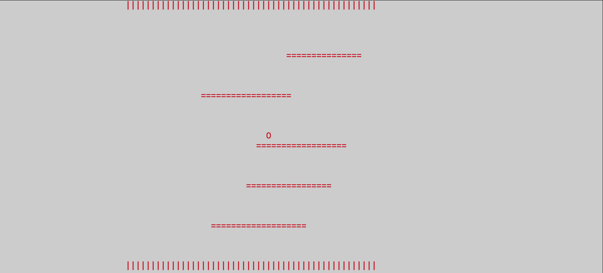
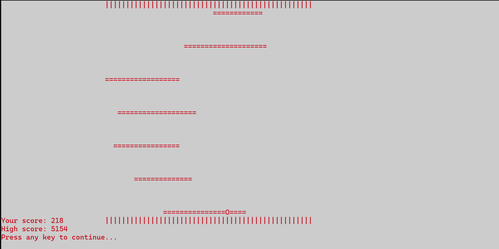

{width="6.1375in"
height="1.6041666666666667in"}

> **PROJECT REPORT**\
> **Project Title:** Rapid Roll (Ping Ball) **Course:** Computer
> Organization Assembly Language Lab (COAL)\
> **Course Instructor:** Mr. Waseem Rauf
>
> **PROJECT MEMBERS:**\
> MUHAMMAD OWAIS RAFIQ (23k-2042) ABUBAKAR BIN HASSAN (23K-2025)

**INTRODUCTION:**

The **Rapid Roll** project is a console-based game implemented entirely
in assembly language. It showcases core concepts of low-level
programming by simulating a simple yet engaging game. Players control a
ball to avoid falling off randomly generated platforms. The project
integrates multi-threading, user input handling, and custom screen
management to deliver smooth gameplay.

This project serves as a bridge between theoretical concepts of assembly
language and practical application, emphasizing real-time systems and
efficient use of resources.

**Features Implemented**

> 1.**Dynamic Platform Generation:** Platforms are randomly generated
> with varying lengths and positions for each game iteration, ensuring
> unique gameplay.
>
> 2.**Multi-Threading:** Separate threads handle platform movement and
> user-controlled ball movement, utilizing Windows API for thread
> management and synchronization.
>
> 3.**Screen Management:** Independent screens for the ball and
> platforms eliminate screen flickering and improve user experience.
>
> 4.**Real-Time User Input:** Continuous monitoring of keyboard input
> allows players to move the ball left or right instantly.
>
> 5.**Score Management:** A scoring mechanism calculates the time
> survived during the game. High scores are saved to and retrieved from
> a file (**score.txt**).
>
> 6.**Collision Detection:** The game identifies when the ball interacts
> with a platform or falls, enforcing gameplay rules and triggering
> game-over conditions.
>
> 7.**Thread Synchronization:** Precise synchronization ensures smooth
> interaction between the ball\'s movement and the platforms\' dynamics.

**Development Workflow**

**3.1 Initialization**

> •The console was configured for game screens and cursor management
> using GetStdHandle and SetConsoleCursorInfo.
>
> •Initial values for the ball\'s position, platform configurations, and
> threading were established.

**3.2 Game Loop**

> •The loop handled:\
> •Platform movement.
>
> •Real-time user input to control the ball. •Continuous updates to the
> game screen.

**3.3 Platform Management**

> •A dedicated thread (PlatformFn) moved platforms upwards and cleared
> those reaching the top.
>
> •Platforms were dynamically regenerated at random lengths and
> positions.

**3.4 Ball Movement**

> •Another thread (BallFn) processed ball movement based on keyboard
>
> inputs.
>
> •Collision detection was implemented to adjust the ball's position and
>
> determine game-over conditions.

**3.5 Score Calculation**

> •Scores were derived from the time elapsed since the start of the
> game. •High scores were saved and compared using file I/O operations.

**Libraries and Technologies Used**

**4.1 Windows API**

> •**CreateScreen, DeleteScreen:** Screen management.
>
> •**ResumeThread, ExitThread:** Multi-threading.
>
> •**ReadConsoleOutputCharacter:** Real-time input handling. •**Sleep:**
> Controlling thread execution timing.

**4.2 Assembly Language Techniques**

> •**Memory Management:** Efficient data structures (e.g., PLATFORM,
> BALL) to
>
> minimize resource usage.

•**Thread Synchronization:** Ensured coordinated movement of the ball
and

> platforms.
>
> •**Console Graphics:** Simplistic yet effective ASCII-based visuals
> for real-time
>
> gameplay.

**Key Challenges and Solutions**

> **1.Real-Time Interaction:**\
> •**Challenge:** Handling simultaneous movements without lag.
> •**Solution:** Implemented multi-threading for ball and platform
>
> updates, synchronized using Windows API.
>
> **2.Screen Flickering:**\
> •**Challenge:** Preventing visual glitches during screen refreshes.
>
> •**Solution:** Created separate screen buffers for the ball and
> platforms.
>
> **3.Collision Detection:**\
> •**Challenge:** Detecting interactions between ball and platforms.
> •**Solution:** Used coordinate comparisons and ASCII checks with
>
> ReadConsoleOutputCharacter.
>
> **4.Randomization of Platforms:**\
> •**Challenge:** Ensuring non-repetitive gameplay.
>
> •**Solution:** Utilized random number generation (RandomRange) for
>
> platform length and position.

**Gameplay Screenshots**

**Screenshots demonstrate the following:**

> •Initial gameplay with ball positioned on a platform.
>
> •Dynamic movement of platforms as the game progresses. •Game-over
> screen displaying the player's score and high score.

{width="6.5in"
height="2.9499989063867016in"}

{width="6.5in"
height="3.2430555555555554in"}

**Lessons Learned**

> •**Multi-Threading:** Gained hands-on experience with managing
> concurrent processes in assembly language.
>
> •**Low-Level Input Handling:** Explored efficient mechanisms for
> real-time keyboard input processing.
>
> •**Resource Optimization:** Learned to manage screen buffers and
> memory effectively for real-time applications.

**Conclusion**

The Rapid Roll project successfully achieved its goals of creating an
engaging console-based game while demonstrating the power and
intricacies of assembly language. By integrating multi-threading,
dynamic platform generation, and real-time input, the game exemplifies
how low-level programming concepts translate into interactive systems.

This project not only serves as a learning experience but also
highlights assembly language\'s relevance in developing real-time
systems and gaming applications.

Future enhancements could include additional features like difficulty
levels, improved graphics, or networked multiplayer support.
